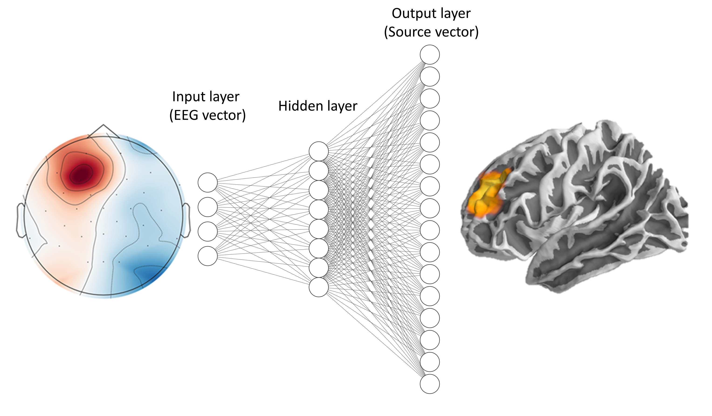

# esinet: Electric Source Imaging using Artificial Neural Networks (ANNs)

**esinet** let's you solve the EEG inverse problem using ANNs with the
mne-python framework. It currently supports three main architectures:


## ConvDip
A convolutional neural network as described in our [first paper](https://www.frontiersin.org/articles/10.3389/fnins.2021.569918/full).


## Fully-connected network

A fully-connected neural network which is trained on single time instances of M/EEG data. This model was described in our [second paper](https://www.biorxiv.org/content/10.1101/2022.04.13.488148v1) alongside the LSTM.

## Long-short term memory network
A Long-short-term memory (LSTM) model which is trained on sequences of EEG data. This model is described in detail and published in our [second paper](https://www.biorxiv.org/content/10.1101/2022.04.13.488148v1).

---

<!--  -->


Neural network design was created [here](http://alexlenail.me/NN-SVG/index.html)

<br/><br/>

## Dependencies:
* [Python](https://www.python.org/downloads/)
* [mne](https://mne.tools/stable/index.html)
  * Follow the [installation guide](https://mne.tools/stable/install/mne_python.html#installing-mne-python-and-its-dependencies)
* [Tensorflow](https://www.tensorflow.org/)
  * Follow the [installation guide](https://www.tensorflow.org/install)
* [Colorednoise](https://github.com/felixpatzelt/colorednoise)
* [joblib](https://joblib.readthedocs.io/en/latest/#)
* [pyvista>=0.24](https://docs.pyvista.org/)
* [pyvistaqt>=0.2.0](https://qtdocs.pyvista.org/)
* [tqdm](https://github.com/tqdm/tqdm)
* [dill](https://dill.readthedocs.io/en/latest/dill.html)
* [sklearn](https://scikit-learn.org/stable/)

<br/>

# Installation from PyPi
Use [pip](https://pip.pypa.io/en/stable/) to install esinet and all its
dependencies from [PyPi](https://pypi.org/):

```
pip install esinet
```

<br/>

# Quick start
The following code demonstrates how to use this package:

```
from esinet import Simulation, Net
from esinet.forward import create_forward_model, get_info

# Create generic Forward Model
info = get_info()
fwd = create_forward_model(info=info, sampling='ico2')

# Simulate M/EEG data
settings = dict(duration_of_trial=0.1)
sim = Simulation(fwd, info, settings=settings)
sim.simulate(n_samples=200)

# Train neural network (LSTM) on the simulated data
net = Net(fwd)
net.fit(sim)

# Plot
stc = net.predict(sim)[0]
sim.source_data[0].plot()
stc.plot()
```

# First steps

Check out one of the [tutorials](tutorials/) to learn how to use the package:

* [Tutorial 1](tutorials/tutorial_1.ipynb): The fastest way to get started with
  *esinet*. This tutorial can be used as an entry point. If you want to dig
  deeper you should have a look at the next tutorials, too!
* [Tutorial 2](tutorials/tutorial_2.ipynb): Use *esinet* with low-level
  functions that allow for more control over your parameters with respect to
  simulations and training of the neural network.
* [Tutorial 3](tutorials/tutorial_3.ipynb): A demonstration of simulation
  parameters and how they affect the model performance.
* [opm_source](tutorials/opm_source.ipynb): Source imaging of optically pumped
  magnetometer (OPM) data. The tutorial is based on the one provided by
  [mne](https://mne.tools/stable/auto_examples/datasets/opm_data.html#sphx-glr-auto-examples-datasets-opm-data-py)

# Feedback
Please leave your feedback and bug reports at lukas_hecker@web.de.

<br/>

# Literature
Please cite these publications if you are using this code:

Hecker, L., Rupprecht, R., van Elst, L. T., & Kornmeier, J. (2022). Long-Short Term Memory Networks for Electric Source Imaging with Distributed Dipole Models. bioRxiv.

Hecker, L., Rupprecht, R., Tebartz van Elst, L., & Kornmeier, J. (2021). ConvDip: A convolutional neural network for better EEG Source Imaging. Frontiers in Neuroscience, 15, 533.


# Troubleshooting
* Having problems with the installation? Check the [package requirements](requirements.txt)
